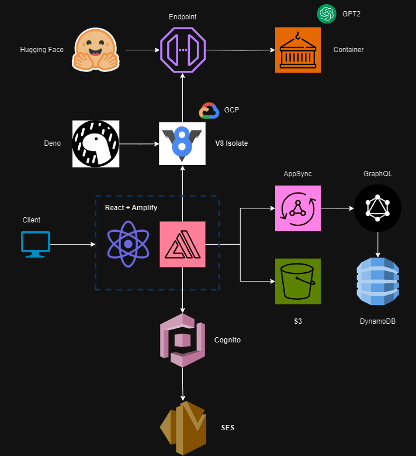
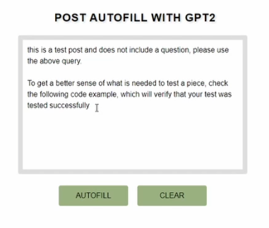
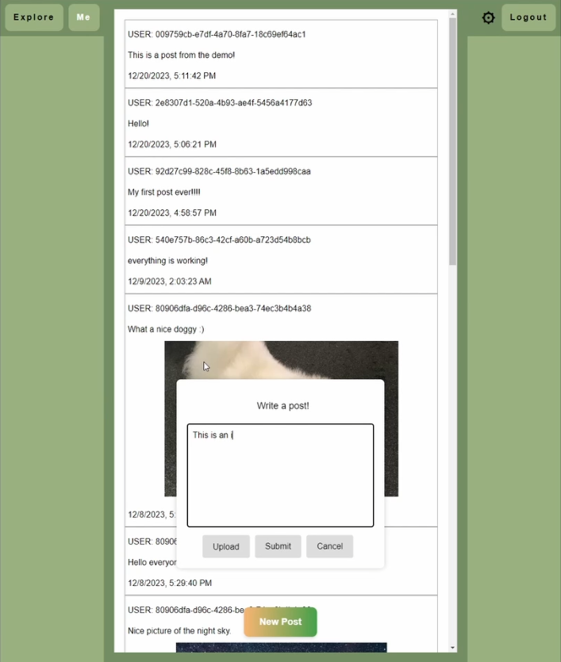

# AWS-Social-Media-Site

Loom is a social media site integrated with GPT2 and hosted on a multitude of services provided by AWS and GCP. A user can make an account with email verification, post text and images, filter out their own content, and autofill their posts with generative AI. Below is the site's architecture, which this README will discuss in further detail.
<br><br>
<p align="center">
  
  <br>
  <em>Figure 1: Architecture Diagram.</em>
</p>

# Contributors

👨‍💻 **Quinn Booth** - `qab2004@columbia.edu`
<br><br>

# Demo & Instructions

Demo of the site:

If the site is still up (unlikely), it can be found at: https://main.d32qlfn97b6d7q.amplifyapp.com/ <br>Services may be shut down to avoid compounding AWS expenses, so watch this demo to see things fully in action.

*** Make sure your audio is ON (video often defaults to muted) ***

https://github.com/quinnbooth/AWS-Social-Media-Site/assets/42872240/4ed6b2a6-5f27-4cd6-80cd-9bdf933bb26d

External link to video: https://youtu.be/W0NEE3GhlN4

Setup instructions:

1) After cloning this repo, open the loom-react-app folder in VSCode and initialize it as a React project.
2) Install the Amplify CLI and run the following. You will need to configure user permissions to interface with your AWS account. <br>```amplify init```
3) Configure authentication, APIs and storage for your app using the following commands. Make sure to use the preexisting resources in the repo, but the specs are flexible. Choose to use DynamoDB with your GraphQL API. <br>```amplify add auth``` ```amplify add api``` ```amplify add storage```
4) Push the backend changes to your application using the following command. You may link your AWS Amplify app to the clone of this repo such that it redeploys upon any future GitHub pushes. <br> ```amplify push```
5) Create a GPT2 instance with the Interference Endpoints service provided by Hugging Face. Find your API key and endpoint address. Give the instance instructions to autocomplete any text provided to it.
6) Host api_proxy.ts in a Deno Playground. Replace the REDACTED fields with the information regarding your Hugging Face endpoint and the address of your Amplify application.
7) After any changes to the code are made, push to GitHub and see the Amplify app automatically redeploy.
<br><br>

# Frontend

The frontend of Loom is implemented using React. The site opens with a login screen. A user can create a new account or use a preexisting one. Logged in, there is a central feed of posts from all users in the 'Explore' tab. These posts may contain images. Creating a new post updates the general feed for all accounts, using the latter described backend database. Each user additionally has a 'Me' tab which filters out only their personal content. Inside the settings, one can autocomplete a post via a GPT2 endpoint. Figures 2 and 3 display these pages, though you can better view them in the demo video above.
<br><br>
<p align="center">
  
  
  <br>
  <em>Figure 2: User authentication and autofill with GPT2 pages.</em>
  <br><br>
   
  <br>
  <em>Figure 3: Central feed page.</em>
</p>
<br>

# Backend

The backend of Loom uses a wide variety of cloud services, mostly provided by AWS. The specific architecture can be seen in Figure 1 above. This section will cover their functionality and use inside the web application. The entire site is built using AWS Amplify as a base.

### AWS Amplify

AWS Amplify is a development platform for building scalable and secure cloud-powered applications. It simplifies the integration of backend services, authentication, and hosting into a frontend application. Amplify also uses the AWS CloudFront content delivery network to get the site to users more locally.

There are three primary subsystems in the backend: user authentication, post storage and autofill with GPT2.

## User Authentication

The user is prompted to login to an account, or create a new one upon opening the site. This is achieved using AWS Cognito, which keeps a running database of users, emails and their verification status. Verification is handled using AWS SES, sending confirmation emails with a numerical code.

### AWS Cognito

Cognito provides secure and scalable user identity and authentication services. It enables one to manage user sign-up, sign-in, and access control for web applications. It includes two main components: User Pools and Identity Pools. User Pools handle user authentication and storage of user profiles, while Identity Pools manage federated identities and provide temporary AWS credentials for accessing other AWS services securely. Everything involved integrates seamlessly with Amplify.

### AWS SES (Simple Email Service)

SES is a cost-effective and scalable emailing service that can send and receive emails. It comes with many templates and viewable analytics.

## Post Storage

Posts made by users are stored using DynamoDB and S3 in conjunction. DynamoDB stores textual data along with timestamps, usernames, and links to any media associated with a post. This media itself is held within S3 buckets. AppSync houses a GraphQL API (REST alternative) to interact with the DynamoDB data.

### AWS AppSync

AWS AppSync is a managed service that simplifies the development of GraphQL APIs. It enables real-time data synchronization and offline capabilities for web applications.

### GraphQL

GraphQL is a query language and runtime for APIs that enables clients to request exactly the data they need. When integrated with AWS AppSync, GraphQL becomes a powerful tool for building efficient and flexible APIs. It allows clients to specify the shape and structure of the data they require, minimizing over-fetching and under-fetching of information.

### AWS DynamoDB

Amazon DynamoDB is a fully managed NoSQL database service with fast and predictable performance. It's designed to scale and provides a flexible data model. DynamoDB is commonly used for storing and retrieving structured data.

### AWS S3 (Simple Storage Service)

Amazon S3 is a highly scalable and durable object storage service. It provides a simple interface to store and retrieve any amount of static media.

## Autofill with GPT2

A user can visit the settings tab to interface with a GPT2 instance through a Hugging Face Interference Endpoint. The instance is hosted within an AWS container. The particular container used in this project had a single Intel Ice Lake 2GB vCPU. The GPT2 model had 124 million parameters. Between the web app and this GPT2 instance sits an API proxy to keep keys secure. This is hosted using Deno, residing in a GCP V8 Isolate.

### GCP V8 Isolate

Somewhat similar to containers, V8 Isolates are instances of the V8 engine which can maintain independent and completely sandboxed state. For further information, please read: https://deno.com/blog/anatomy-isolate-cloud

### Container

A container is a lightweight, portable software package that encapsulates an application and its dependencies, ensuring consistency and isolation across different computing environments. Containers are resource-efficient, easily deployable, and scalable. They are a more modern alternative to virtual machines.

Amazon ECS is a fully managed container orchestration service that supports Docker containers. It allows one to run, stop, and manage containers across a cluster of EC2 instances. 
<br><br>

# Concluding Remarks

Loom is a complex social media application hosted in the cloud with a wide variety of different AWS and GCP services. It integrates GPT2 to autofill posts and allows communication between a pool of authenticated users. 

Hopefully you find this project interesting and inspirational! Thanks for taking the time to check it out.
